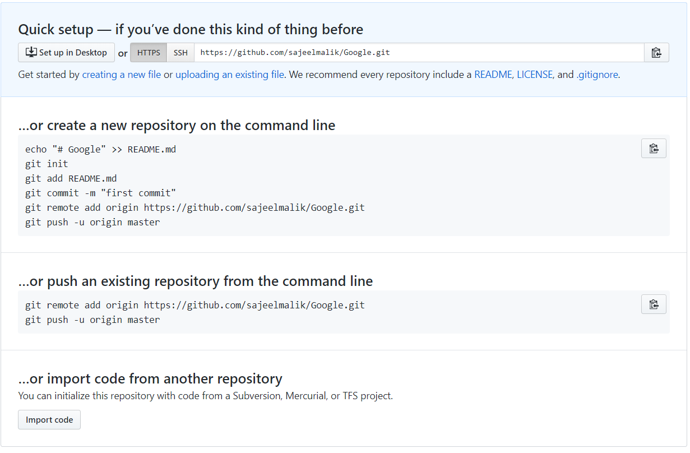

# **03-MyGoogle**

In this exercise, we will write a very basic searching algorithm and update our NPM package so that others can utilize our functionality.
We also want to create a GitHub repository so that others can see our code online!

1. In your GitHub, create an empty repository named **Google**. "Empty" means do NOT add a README nor a .gitignore nor a LICENSE! For this exercise, we will manually add those later.

Your repo should look like this: 



2. Locally, in your *google* directory, run the following command:

    **`git init`**.

    This will create a `.git` file in your directory and set up your repo for version control. 

3. Copy your repo's HTTPS link (located next to the gray HTTPS button). Let's run the following commands in successful to finalize your git connection.

    - **`git add .`**

    -  **`git commit -m "first commit"`**

    -  **`git remote add origin [ENTER YOUR HTTPS LINK HERE]`**

    - **`git push -u origin master`**

4. Now, let's actually write some code.

## Open **Google.js**

* **Create an object** named **"Google"** (We might want to create a Class, but let's stick to ES5 Javascript for now). You can look at the `/Solved` directory at any time, but try to complete this exercise for practice. 

    ```Javascript
    var Google = {

    }
    ```

* In our object, let's create a basic search function named **"search"** that takes in two arguments, an array and a variable.


* In the function, **create a results object** with two keys: **positions** *(an empty array)*, and **count** *(a number starting at 0)*.


* **Search *(hint: iterate)*** through the array and find all the instances of the input variable. 


    * When you find the variable in the array, update the results object; push the current index to our "positions" array, and increment the "count" by one.


* The function should **return** our results object.

* **Export** your Google object

* ### Feel free to add your own functionality to this project!

### **BONUSES:**

 1. Create a second function called "searchOnline" which takes in a string as a search query and opens a browser search for that query. Remember, we are running in nodejs.

 2. In your results object, add a key for "time" that **RETURNS** the time it took, in seconds and rounded to two decimal places, for your search execution to run. This may be hard to find.


 ## **COPY THE GOOGLE.JS FILE INTO YOUR /Google DIRECTORY**

 <hr>

### **Proceed to 04-PublishPackage**


