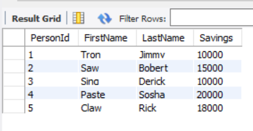
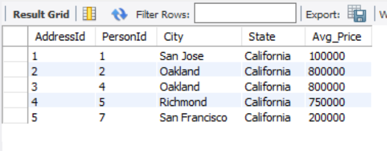
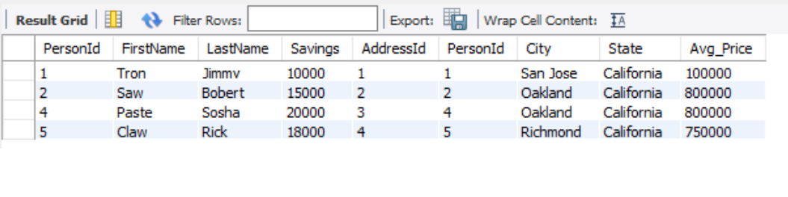
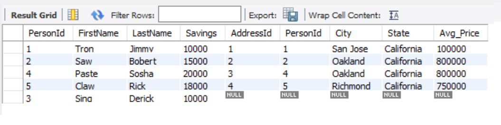
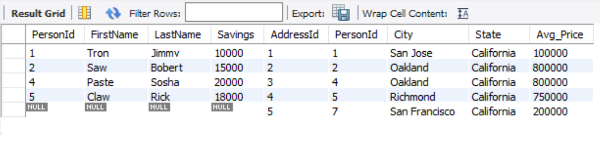
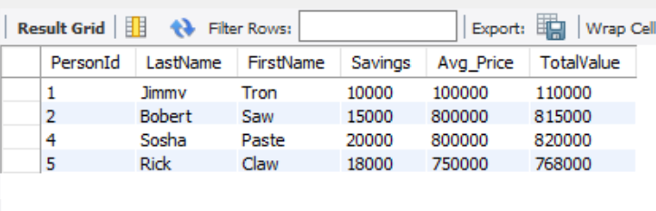

# Joining and searching.

You'll be using various joining methods and creating a calculated column.

## Create Schema and Seeds
Start by creating the two tables "people" and "address".

People table contains the following columns 
* PersonId
* FirstName
* LastName
* Savings

Address table contains the following columns 
* AddressId
* PersonId
* City
* State
* Avg_Price

## Example of query outputs:

Output 1:

Output 2:

Output 3:

Output 4:

