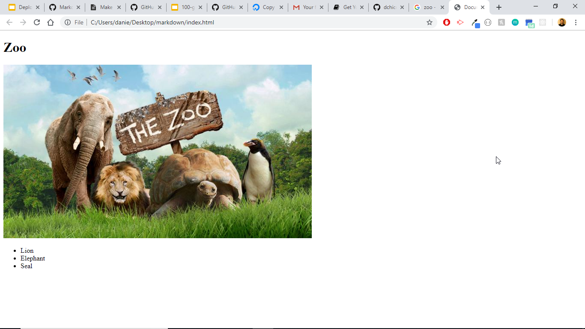

# This is a header
## This is a smaller header
### This is an even smaller header!

# This is my Project
## this is a smaller version

 

*Italics*
*Hello*

 

**Bold**

 

# ***Bold, Italics, and a Header***

 

This is an Image
=================

 
This is a Link
==============
[LinkedIn](https://www.linkedin.com/in/dchicchon/)

 

<h1>You can still use HTML tags in markdown</h1>

 

# Lists
### Unordered Lists
- Item
- Item  
- Item
- item

### Ordered Lists

1. Item
2. Item
3. Item

 

# Tables

